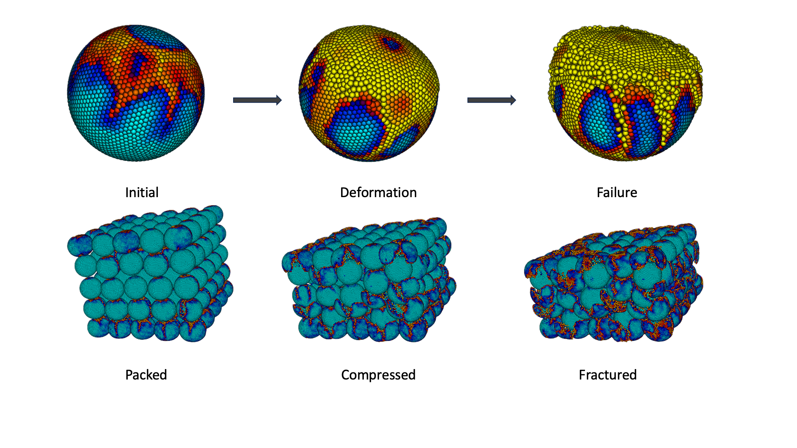

# PeriDEM
<<<<<<< HEAD
Peridynamics-based framework for simulating crushing and fracture in granular materials
=======

**Crushing, Comminution and Fracture in Granular Aggregates**  
A high-fidelity computational framework for simulating extreme deformation and fracture in granular materials using peridynamics.

[](LICENSE)
[](https://arxiv.org/abs/2506.05362)

  <!-- Replace with your actual GIF path -->

---

##  Overview

This repository accompanies the work:

> **Crushing, Comminution and Fracture: Extreme Particle Deformation in Three-Dimensional Granular Aggregates**  
> D. Bhattacharya, D. Damircheli, R. P. Lipton  
> *arXiv preprint* [arXiv:2506.05362](https://arxiv.org/abs/2506.05362)

The framework captures:
- Arbitrarily shaped particles meshed from CT data
- Intra-particle deformation using bond-based peridynamics
- Inter-particle contact response and collision handling
- Support for HPC execution via Singularity containers

---

##  Installation

### Linux/macOS
Clone the repo and install using one of the provided scripts:
```bash
./install_linux.sh       # or ./install_mac.sh
```

Or build a container:
```bash
singularity build periDEM.sif ./docs/periDEM.def
```

---

##  Dependencies

### System
- [Eigen3](http://eigen.tuxfamily.org/index.php?title=Main_Page)
- `gmsh` (mesh generation)
- `hdf5`, `h5dump` (data IO)
- MPI (`mpich` 4.1.2 or OpenMPI)
- Intel oneAPI toolkit (optional for optimized builds)

### Python (see `requirements.txt`)
- `numpy`, `matplotlib`, `scipy`, `seaborn`
- `pygmsh`, `meshio`, `gmsh`
- `gekko`, `pathos`, `mpi4py`

---

##  Usage

### Regular use (Local)
From the **root directory**, run:
```bash
./examples/myExample/run.sh
```

### HPC use (Containerized)
After building the `.sif` container:
```bash
singularity exec periDEM.sif ./examples/myExample/run.sh
# Then submit your Slurm job as usual
```

Simulation results are written to `examples_output/`.

---

##  Reproducibility

Each figure in the paper corresponds to a script in `examples/`.  
The input mesh files and processed outputs are available at:

 [https://arxiv.org/abs/2506.05362](https://arxiv.org/abs/2506.05362)  

---

##  Authors and Acknowledgment

This project was developed collaboratively. Contributions are as follows:

- **Robert P. Lipton** –  conceptualization, initiated the project, modeling 
- **Debdeep Bhattacharya** – developer, developed the original 2D simulation code, and designed the architecture for the 3D extension.
- **Davood Damircheli** – developer, extended and optimized the 3D implementation, developed the HPC-compatible container environment, designed and executed large-scale simulations on supercomputing clusters.

> Please cite our paper if you use this code.

---

##  License

This project is licensed under the MIT License — see the [LICENSE](LICENSE) file.

---

##  Citation

```bibtex
@article{bhattacharya2025crushing,
  title={Crushing, Comminution and Fracture: Extreme Particle Deformation in Three-Dimensional Granular Aggregates},
  author={Bhattacharya, Debdeep and Damircheli, Davood and Lipton, Robert P.},
  journal={arXiv preprint arXiv:2506.05362},
  year={2025}
}
```
>>>>>>> f93b732 (Initial public release of PeriDEM)
